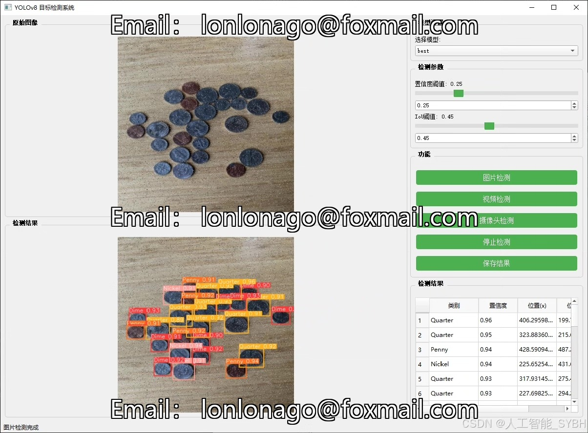
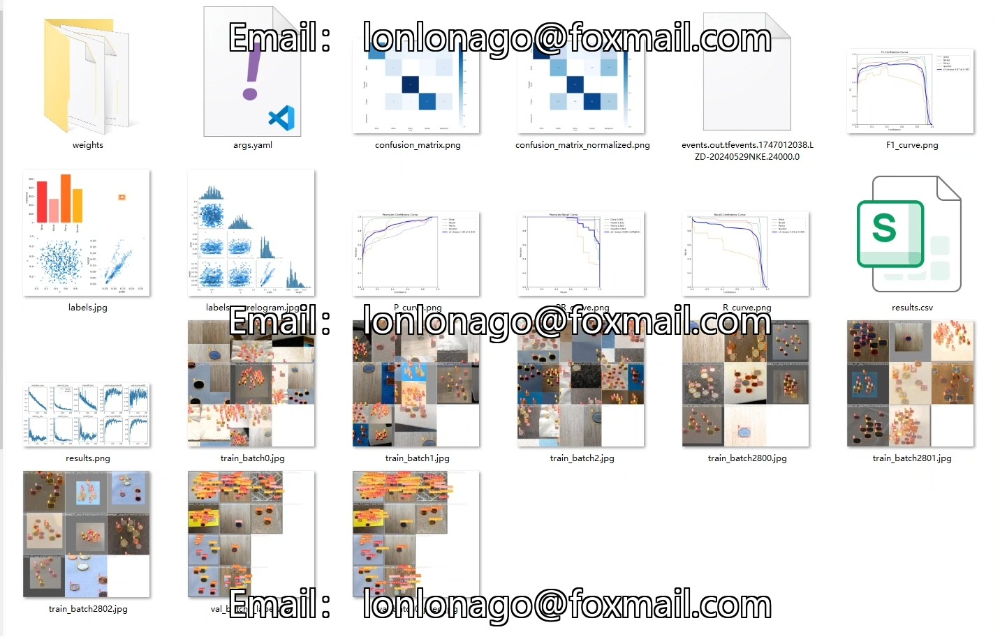
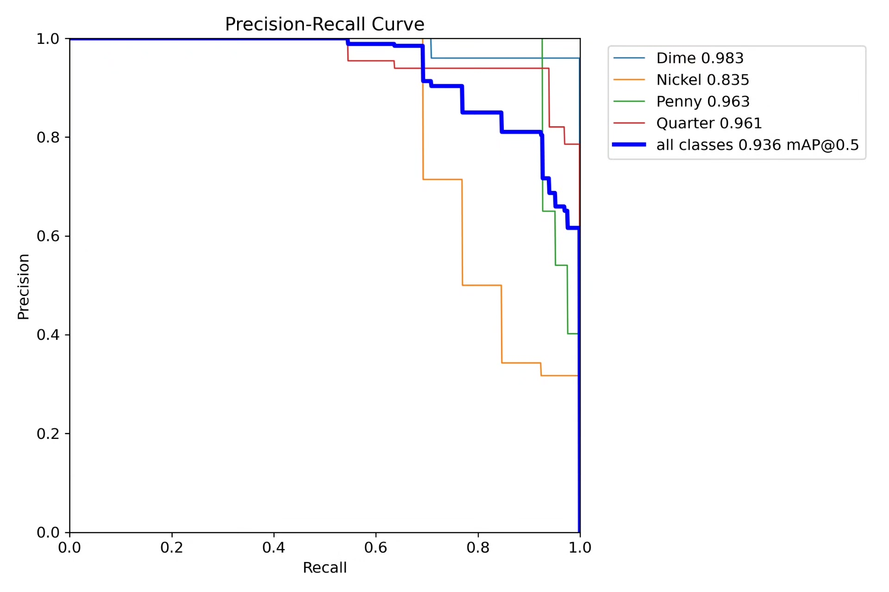
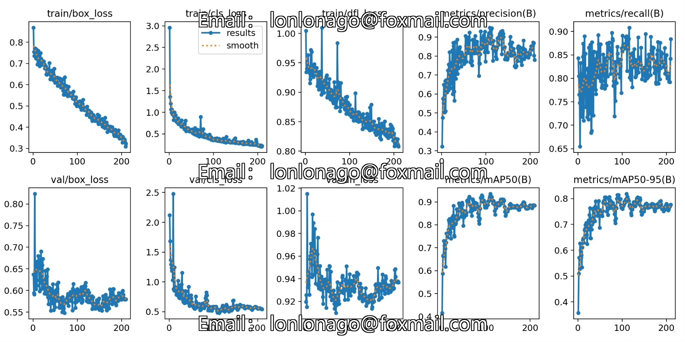
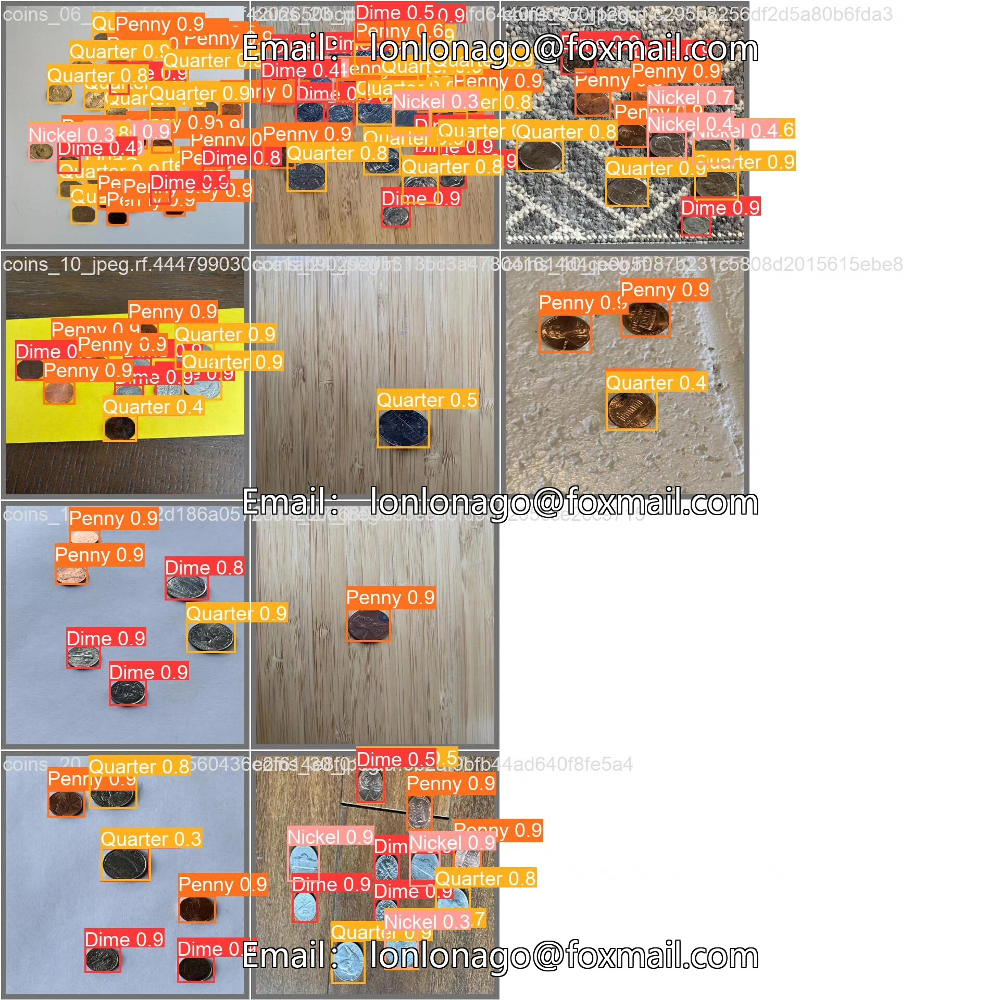
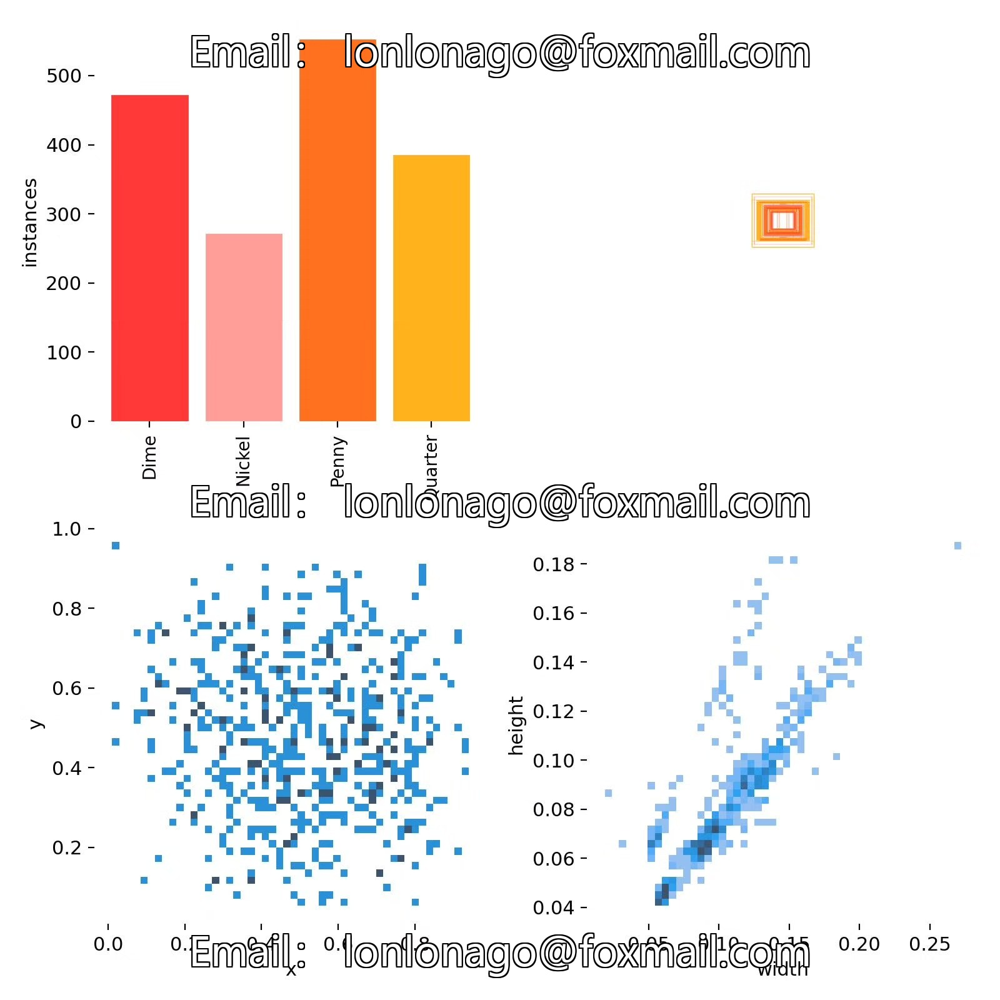

# YOLOv8-based American coin recognition detection system

## Body

Based on the YOLOv8 object detection algorithm, this project has developed a set of automatic coin recognition systems for the United States. It can accurately recognize and classify four common American coins: Dime (10 cents), Nickel (5 cents), Penny (1 cent), and Quarter (25 cents). The system uses computer vision technology to achieve real-time detection and classification of coins, with high recognition accuracy and robustness. The project uses custom datasets for model training, and data augmentation techniques are used to improve the generalization ability of the model. This system can be applied in various scenarios such as automatic vending machines, self-service checkout counters, and bank currency sorting, providing an efficient technical solution for automated coin processing.

The company's products have obtained YOLO official commercial license certification.

We provide after-sales service.

After payment, we will provide WeChat ID for any questions.

Environment configuration: We will provide a tutorial on environment configuration, and WeChat will provide answers.

Remote installation service: If you need remote configuration, an additional fee of 69 is required.
If the configuration fails, all fees will be refunded (only the installation fee is refundable for older computers).

Retraining dataset: After setting up the environment, you can train on your own computer.
If you need us to retrain, just pay 69 plus computing power fees (2.5 yuan/hour).

Full after-sales service

## Images

## Payment

Here is a pay link on Stripe ( https://buy.stripe.com/3cs8yP7sY87d0vu9AB ). Please contact me lonlonago@foxmail.com after funding $89, and I will send you a complete data files , thank you!

